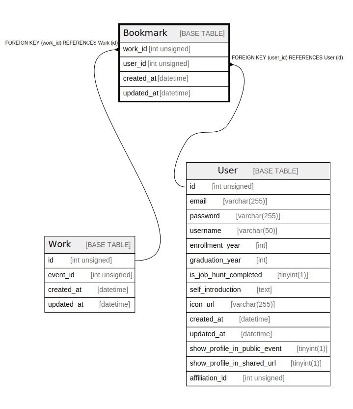

# Bookmark

## Description

<details>
<summary><strong>Table Definition</strong></summary>

```sql
CREATE TABLE `Bookmark` (
  `work_id` int unsigned NOT NULL,
  `user_id` int unsigned NOT NULL,
  `created_at` datetime DEFAULT CURRENT_TIMESTAMP,
  `updated_at` datetime DEFAULT CURRENT_TIMESTAMP,
  PRIMARY KEY (`work_id`,`user_id`),
  KEY `Bookmark_user_id_idx` (`user_id`),
  KEY `Bookmark_work_id_idx` (`work_id`),
  CONSTRAINT `Bookmark_user_id_fkey` FOREIGN KEY (`user_id`) REFERENCES `User` (`id`) ON DELETE RESTRICT ON UPDATE CASCADE,
  CONSTRAINT `Bookmark_work_id_fkey` FOREIGN KEY (`work_id`) REFERENCES `Work` (`id`) ON DELETE RESTRICT ON UPDATE CASCADE
) ENGINE=InnoDB DEFAULT CHARSET=utf8mb4 COLLATE=utf8mb4_unicode_ci
```

</details>

## Columns

| Name | Type | Default | Nullable | Extra Definition | Children | Parents | Comment |
| ---- | ---- | ------- | -------- | ---------------- | -------- | ------- | ------- |
| work_id | int unsigned |  | false |  |  | [Work](Work.md) |  |
| user_id | int unsigned |  | false |  |  | [User](User.md) |  |
| created_at | datetime | CURRENT_TIMESTAMP | true | DEFAULT_GENERATED |  |  |  |
| updated_at | datetime | CURRENT_TIMESTAMP | true | DEFAULT_GENERATED |  |  |  |

## Constraints

| Name | Type | Definition |
| ---- | ---- | ---------- |
| Bookmark_user_id_fkey | FOREIGN KEY | FOREIGN KEY (user_id) REFERENCES User (id) |
| Bookmark_work_id_fkey | FOREIGN KEY | FOREIGN KEY (work_id) REFERENCES Work (id) |
| PRIMARY | PRIMARY KEY | PRIMARY KEY (work_id, user_id) |

## Indexes

| Name | Definition |
| ---- | ---------- |
| Bookmark_user_id_idx | KEY Bookmark_user_id_idx (user_id) USING BTREE |
| Bookmark_work_id_idx | KEY Bookmark_work_id_idx (work_id) USING BTREE |
| PRIMARY | PRIMARY KEY (work_id, user_id) USING BTREE |

## Relations



---

> Generated by [tbls](https://github.com/k1LoW/tbls)
