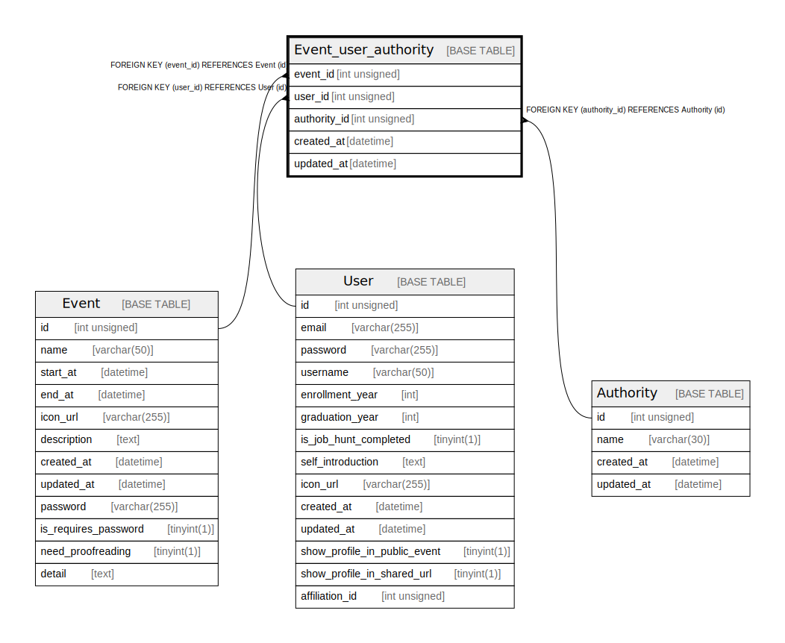

# Event_user_authority

## Description

<details>
<summary><strong>Table Definition</strong></summary>

```sql
CREATE TABLE `Event_user_authority` (
  `event_id` int unsigned NOT NULL,
  `user_id` int unsigned NOT NULL,
  `authority_id` int unsigned NOT NULL,
  `created_at` datetime DEFAULT CURRENT_TIMESTAMP,
  `updated_at` datetime DEFAULT CURRENT_TIMESTAMP,
  PRIMARY KEY (`event_id`,`user_id`,`authority_id`),
  KEY `Event_user_authority_event_id_idx` (`event_id`),
  KEY `Event_user_authority_authority_id_idx` (`authority_id`),
  KEY `Event_user_authority_user_id_idx` (`user_id`),
  CONSTRAINT `Event_user_authority_authority_id_fkey` FOREIGN KEY (`authority_id`) REFERENCES `Authority` (`id`) ON DELETE RESTRICT ON UPDATE CASCADE,
  CONSTRAINT `Event_user_authority_event_id_fkey` FOREIGN KEY (`event_id`) REFERENCES `Event` (`id`) ON DELETE RESTRICT ON UPDATE CASCADE,
  CONSTRAINT `Event_user_authority_user_id_fkey` FOREIGN KEY (`user_id`) REFERENCES `User` (`id`) ON DELETE RESTRICT ON UPDATE CASCADE
) ENGINE=InnoDB DEFAULT CHARSET=utf8mb4 COLLATE=utf8mb4_unicode_ci
```

</details>

## Columns

| Name | Type | Default | Nullable | Extra Definition | Children | Parents | Comment |
| ---- | ---- | ------- | -------- | ---------------- | -------- | ------- | ------- |
| event_id | int unsigned |  | false |  |  | [Event](Event.md) |  |
| user_id | int unsigned |  | false |  |  | [User](User.md) |  |
| authority_id | int unsigned |  | false |  |  | [Authority](Authority.md) |  |
| created_at | datetime | CURRENT_TIMESTAMP | true | DEFAULT_GENERATED |  |  |  |
| updated_at | datetime | CURRENT_TIMESTAMP | true | DEFAULT_GENERATED |  |  |  |

## Constraints

| Name | Type | Definition |
| ---- | ---- | ---------- |
| Event_user_authority_authority_id_fkey | FOREIGN KEY | FOREIGN KEY (authority_id) REFERENCES Authority (id) |
| Event_user_authority_event_id_fkey | FOREIGN KEY | FOREIGN KEY (event_id) REFERENCES Event (id) |
| Event_user_authority_user_id_fkey | FOREIGN KEY | FOREIGN KEY (user_id) REFERENCES User (id) |
| PRIMARY | PRIMARY KEY | PRIMARY KEY (event_id, user_id, authority_id) |

## Indexes

| Name | Definition |
| ---- | ---------- |
| Event_user_authority_authority_id_idx | KEY Event_user_authority_authority_id_idx (authority_id) USING BTREE |
| Event_user_authority_event_id_idx | KEY Event_user_authority_event_id_idx (event_id) USING BTREE |
| Event_user_authority_user_id_idx | KEY Event_user_authority_user_id_idx (user_id) USING BTREE |
| PRIMARY | PRIMARY KEY (event_id, user_id, authority_id) USING BTREE |

## Relations



---

> Generated by [tbls](https://github.com/k1LoW/tbls)
