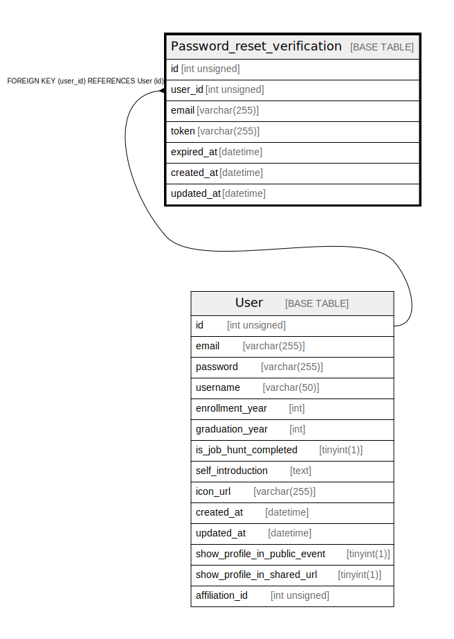

# Password_reset_verification

## Description

<details>
<summary><strong>Table Definition</strong></summary>

```sql
CREATE TABLE `Password_reset_verification` (
  `id` int unsigned NOT NULL AUTO_INCREMENT,
  `user_id` int unsigned NOT NULL,
  `email` varchar(255) COLLATE utf8mb4_unicode_ci NOT NULL,
  `token` varchar(255) COLLATE utf8mb4_unicode_ci NOT NULL,
  `expired_at` datetime NOT NULL,
  `created_at` datetime DEFAULT CURRENT_TIMESTAMP,
  `updated_at` datetime DEFAULT CURRENT_TIMESTAMP,
  PRIMARY KEY (`id`),
  UNIQUE KEY `email` (`email`),
  KEY `Password_reset_verification_user_id_fkey` (`user_id`),
  CONSTRAINT `Password_reset_verification_user_id_fkey` FOREIGN KEY (`user_id`) REFERENCES `User` (`id`) ON DELETE RESTRICT ON UPDATE CASCADE
) ENGINE=InnoDB DEFAULT CHARSET=utf8mb4 COLLATE=utf8mb4_unicode_ci
```

</details>

## Columns

| Name | Type | Default | Nullable | Extra Definition | Children | Parents | Comment |
| ---- | ---- | ------- | -------- | ---------------- | -------- | ------- | ------- |
| id | int unsigned |  | false | auto_increment |  |  |  |
| user_id | int unsigned |  | false |  |  | [User](User.md) |  |
| email | varchar(255) |  | false |  |  |  |  |
| token | varchar(255) |  | false |  |  |  |  |
| expired_at | datetime |  | false |  |  |  |  |
| created_at | datetime | CURRENT_TIMESTAMP | true | DEFAULT_GENERATED |  |  |  |
| updated_at | datetime | CURRENT_TIMESTAMP | true | DEFAULT_GENERATED |  |  |  |

## Constraints

| Name | Type | Definition |
| ---- | ---- | ---------- |
| email | UNIQUE | UNIQUE KEY email (email) |
| Password_reset_verification_user_id_fkey | FOREIGN KEY | FOREIGN KEY (user_id) REFERENCES User (id) |
| PRIMARY | PRIMARY KEY | PRIMARY KEY (id) |

## Indexes

| Name | Definition |
| ---- | ---------- |
| Password_reset_verification_user_id_fkey | KEY Password_reset_verification_user_id_fkey (user_id) USING BTREE |
| PRIMARY | PRIMARY KEY (id) USING BTREE |
| email | UNIQUE KEY email (email) USING BTREE |

## Relations



---

> Generated by [tbls](https://github.com/k1LoW/tbls)
