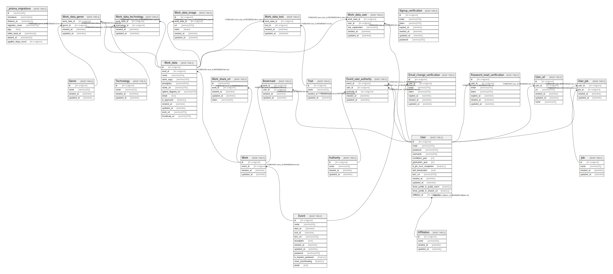

# e-ten

## Tables

| Name | Columns | Comment | Type |
| ---- | ------- | ------- | ---- |
| [_prisma_migrations](_prisma_migrations.md) | 8 |  | BASE TABLE |
| [Affiliation](Affiliation.md) | 4 |  | BASE TABLE |
| [Authority](Authority.md) | 4 |  | BASE TABLE |
| [Bookmark](Bookmark.md) | 4 |  | BASE TABLE |
| [Email_change_verification](Email_change_verification.md) | 7 |  | BASE TABLE |
| [Event](Event.md) | 12 |  | BASE TABLE |
| [Event_user_authority](Event_user_authority.md) | 5 |  | BASE TABLE |
| [Genre](Genre.md) | 4 |  | BASE TABLE |
| [Job](Job.md) | 4 |  | BASE TABLE |
| [Password_reset_verification](Password_reset_verification.md) | 7 |  | BASE TABLE |
| [Signup_verification](Signup_verification.md) | 7 |  | BASE TABLE |
| [Technology](Technology.md) | 4 |  | BASE TABLE |
| [Tool](Tool.md) | 4 |  | BASE TABLE |
| [User](User.md) | 14 |  | BASE TABLE |
| [User_job](User_job.md) | 4 |  | BASE TABLE |
| [User_url](User_url.md) | 6 |  | BASE TABLE |
| [Work](Work.md) | 4 |  | BASE TABLE |
| [Work_data](Work_data.md) | 13 |  | BASE TABLE |
| [Work_data_genre](Work_data_genre.md) | 4 |  | BASE TABLE |
| [Work_data_image](Work_data_image.md) | 6 |  | BASE TABLE |
| [Work_data_technology](Work_data_technology.md) | 4 |  | BASE TABLE |
| [Work_data_tool](Work_data_tool.md) | 4 |  | BASE TABLE |
| [Work_data_user](Work_data_user.md) | 5 |  | BASE TABLE |
| [Work_share_url](Work_share_url.md) | 5 |  | BASE TABLE |

## Relations

---

> Generated by [tbls](https://github.com/k1LoW/tbls)
