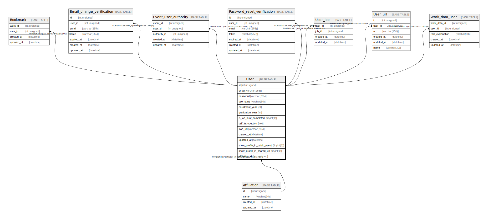

# User

## Description

<details>
<summary><strong>Table Definition</strong></summary>

```sql
CREATE TABLE `User` (
  `id` int unsigned NOT NULL AUTO_INCREMENT,
  `email` varchar(255) COLLATE utf8mb4_unicode_ci NOT NULL,
  `password` varchar(255) COLLATE utf8mb4_unicode_ci NOT NULL,
  `username` varchar(50) COLLATE utf8mb4_unicode_ci DEFAULT NULL,
  `enrollment_year` int DEFAULT NULL,
  `graduation_year` int DEFAULT NULL,
  `is_job_hunt_completed` tinyint(1) NOT NULL DEFAULT '0',
  `self_introduction` text COLLATE utf8mb4_unicode_ci,
  `icon_url` varchar(255) COLLATE utf8mb4_unicode_ci DEFAULT NULL,
  `created_at` datetime DEFAULT CURRENT_TIMESTAMP,
  `updated_at` datetime DEFAULT CURRENT_TIMESTAMP,
  `show_profile_in_public_event` tinyint(1) NOT NULL DEFAULT '0',
  `show_profile_in_shared_url` tinyint(1) NOT NULL DEFAULT '0',
  `affiliation_id` int unsigned DEFAULT NULL,
  PRIMARY KEY (`id`),
  UNIQUE KEY `email` (`email`),
  KEY `User_affiliation_id_idx` (`affiliation_id`),
  CONSTRAINT `User_affiliation_id_fkey` FOREIGN KEY (`affiliation_id`) REFERENCES `Affiliation` (`id`) ON DELETE SET NULL ON UPDATE CASCADE
) ENGINE=InnoDB AUTO_INCREMENT=[Redacted by tbls] DEFAULT CHARSET=utf8mb4 COLLATE=utf8mb4_unicode_ci
```

</details>

## Columns

| Name | Type | Default | Nullable | Extra Definition | Children | Parents | Comment |
| ---- | ---- | ------- | -------- | ---------------- | -------- | ------- | ------- |
| id | int unsigned |  | false | auto_increment | [Bookmark](Bookmark.md) [Email_change_verification](Email_change_verification.md) [Event_user_authority](Event_user_authority.md) [Password_reset_verification](Password_reset_verification.md) [User_job](User_job.md) [User_url](User_url.md) [Work_data_user](Work_data_user.md) |  |  |
| email | varchar(255) |  | false |  |  |  |  |
| password | varchar(255) |  | false |  |  |  |  |
| username | varchar(50) |  | true |  |  |  |  |
| enrollment_year | int |  | true |  |  |  |  |
| graduation_year | int |  | true |  |  |  |  |
| is_job_hunt_completed | tinyint(1) | 0 | false |  |  |  |  |
| self_introduction | text |  | true |  |  |  |  |
| icon_url | varchar(255) |  | true |  |  |  |  |
| created_at | datetime | CURRENT_TIMESTAMP | true | DEFAULT_GENERATED |  |  |  |
| updated_at | datetime | CURRENT_TIMESTAMP | true | DEFAULT_GENERATED |  |  |  |
| show_profile_in_public_event | tinyint(1) | 0 | false |  |  |  |  |
| show_profile_in_shared_url | tinyint(1) | 0 | false |  |  |  |  |
| affiliation_id | int unsigned |  | true |  |  | [Affiliation](Affiliation.md) |  |

## Constraints

| Name | Type | Definition |
| ---- | ---- | ---------- |
| email | UNIQUE | UNIQUE KEY email (email) |
| PRIMARY | PRIMARY KEY | PRIMARY KEY (id) |
| User_affiliation_id_fkey | FOREIGN KEY | FOREIGN KEY (affiliation_id) REFERENCES Affiliation (id) |

## Indexes

| Name | Definition |
| ---- | ---------- |
| User_affiliation_id_idx | KEY User_affiliation_id_idx (affiliation_id) USING BTREE |
| PRIMARY | PRIMARY KEY (id) USING BTREE |
| email | UNIQUE KEY email (email) USING BTREE |

## Relations



---

> Generated by [tbls](https://github.com/k1LoW/tbls)
