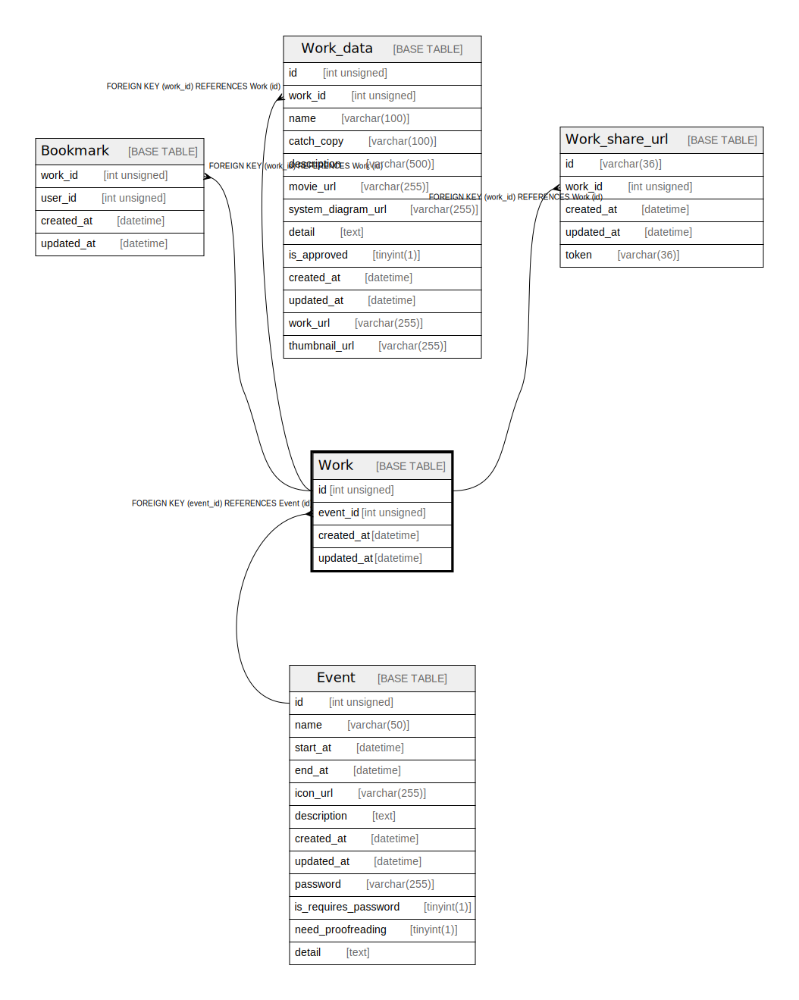

# Work

## Description

<details>
<summary><strong>Table Definition</strong></summary>

```sql
CREATE TABLE `Work` (
  `id` int unsigned NOT NULL AUTO_INCREMENT,
  `event_id` int unsigned NOT NULL,
  `created_at` datetime DEFAULT CURRENT_TIMESTAMP,
  `updated_at` datetime DEFAULT CURRENT_TIMESTAMP,
  PRIMARY KEY (`id`),
  KEY `Work_event_id_idx` (`event_id`),
  CONSTRAINT `Work_event_id_fkey` FOREIGN KEY (`event_id`) REFERENCES `Event` (`id`) ON DELETE RESTRICT ON UPDATE CASCADE
) ENGINE=InnoDB AUTO_INCREMENT=[Redacted by tbls] DEFAULT CHARSET=utf8mb4 COLLATE=utf8mb4_unicode_ci
```

</details>

## Columns

| Name | Type | Default | Nullable | Extra Definition | Children | Parents | Comment |
| ---- | ---- | ------- | -------- | ---------------- | -------- | ------- | ------- |
| id | int unsigned |  | false | auto_increment | [Bookmark](Bookmark.md) [Work_data](Work_data.md) [Work_share_url](Work_share_url.md) |  |  |
| event_id | int unsigned |  | false |  |  | [Event](Event.md) |  |
| created_at | datetime | CURRENT_TIMESTAMP | true | DEFAULT_GENERATED |  |  |  |
| updated_at | datetime | CURRENT_TIMESTAMP | true | DEFAULT_GENERATED |  |  |  |

## Constraints

| Name | Type | Definition |
| ---- | ---- | ---------- |
| PRIMARY | PRIMARY KEY | PRIMARY KEY (id) |
| Work_event_id_fkey | FOREIGN KEY | FOREIGN KEY (event_id) REFERENCES Event (id) |

## Indexes

| Name | Definition |
| ---- | ---------- |
| Work_event_id_idx | KEY Work_event_id_idx (event_id) USING BTREE |
| PRIMARY | PRIMARY KEY (id) USING BTREE |

## Relations



---

> Generated by [tbls](https://github.com/k1LoW/tbls)
