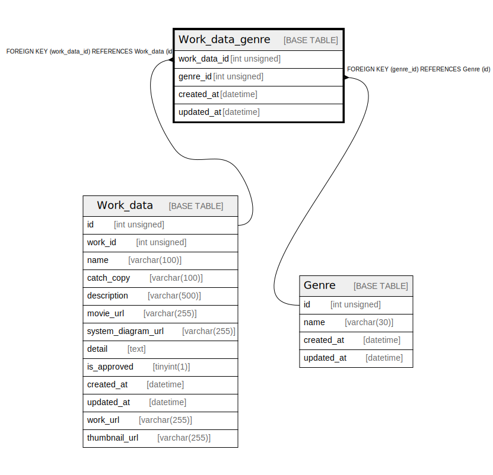

# Work_data_genre

## Description

<details>
<summary><strong>Table Definition</strong></summary>

```sql
CREATE TABLE `Work_data_genre` (
  `work_data_id` int unsigned NOT NULL,
  `genre_id` int unsigned NOT NULL,
  `created_at` datetime DEFAULT CURRENT_TIMESTAMP,
  `updated_at` datetime DEFAULT CURRENT_TIMESTAMP,
  PRIMARY KEY (`work_data_id`,`genre_id`),
  KEY `Work_data_genre_genre_id_idx` (`genre_id`),
  KEY `Work_data_genre_work_data_id_idx` (`work_data_id`),
  CONSTRAINT `Work_data_genre_genre_id_fkey` FOREIGN KEY (`genre_id`) REFERENCES `Genre` (`id`) ON DELETE RESTRICT ON UPDATE CASCADE,
  CONSTRAINT `Work_data_genre_work_data_id_fkey` FOREIGN KEY (`work_data_id`) REFERENCES `Work_data` (`id`) ON DELETE RESTRICT ON UPDATE CASCADE
) ENGINE=InnoDB DEFAULT CHARSET=utf8mb4 COLLATE=utf8mb4_unicode_ci
```

</details>

## Columns

| Name | Type | Default | Nullable | Extra Definition | Children | Parents | Comment |
| ---- | ---- | ------- | -------- | ---------------- | -------- | ------- | ------- |
| work_data_id | int unsigned |  | false |  |  | [Work_data](Work_data.md) |  |
| genre_id | int unsigned |  | false |  |  | [Genre](Genre.md) |  |
| created_at | datetime | CURRENT_TIMESTAMP | true | DEFAULT_GENERATED |  |  |  |
| updated_at | datetime | CURRENT_TIMESTAMP | true | DEFAULT_GENERATED |  |  |  |

## Constraints

| Name | Type | Definition |
| ---- | ---- | ---------- |
| PRIMARY | PRIMARY KEY | PRIMARY KEY (work_data_id, genre_id) |
| Work_data_genre_genre_id_fkey | FOREIGN KEY | FOREIGN KEY (genre_id) REFERENCES Genre (id) |
| Work_data_genre_work_data_id_fkey | FOREIGN KEY | FOREIGN KEY (work_data_id) REFERENCES Work_data (id) |

## Indexes

| Name | Definition |
| ---- | ---------- |
| Work_data_genre_genre_id_idx | KEY Work_data_genre_genre_id_idx (genre_id) USING BTREE |
| Work_data_genre_work_data_id_idx | KEY Work_data_genre_work_data_id_idx (work_data_id) USING BTREE |
| PRIMARY | PRIMARY KEY (work_data_id, genre_id) USING BTREE |

## Relations



---

> Generated by [tbls](https://github.com/k1LoW/tbls)
