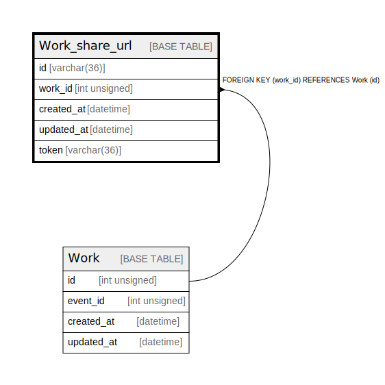

# Work_share_url

## Description

<details>
<summary><strong>Table Definition</strong></summary>

```sql
CREATE TABLE `Work_share_url` (
  `id` varchar(36) COLLATE utf8mb4_unicode_ci NOT NULL,
  `work_id` int unsigned NOT NULL,
  `created_at` datetime NOT NULL DEFAULT CURRENT_TIMESTAMP,
  `updated_at` datetime NOT NULL DEFAULT CURRENT_TIMESTAMP,
  `token` varchar(36) COLLATE utf8mb4_unicode_ci NOT NULL,
  PRIMARY KEY (`id`),
  UNIQUE KEY `Work_share_url_work_id_key` (`work_id`),
  UNIQUE KEY `Work_share_url_token_key` (`token`),
  CONSTRAINT `Work_share_url_work_id_fkey` FOREIGN KEY (`work_id`) REFERENCES `Work` (`id`) ON DELETE RESTRICT ON UPDATE CASCADE
) ENGINE=InnoDB DEFAULT CHARSET=utf8mb4 COLLATE=utf8mb4_unicode_ci
```

</details>

## Columns

| Name | Type | Default | Nullable | Extra Definition | Children | Parents | Comment |
| ---- | ---- | ------- | -------- | ---------------- | -------- | ------- | ------- |
| id | varchar(36) |  | false |  |  |  |  |
| work_id | int unsigned |  | false |  |  | [Work](Work.md) |  |
| created_at | datetime | CURRENT_TIMESTAMP | false | DEFAULT_GENERATED |  |  |  |
| updated_at | datetime | CURRENT_TIMESTAMP | false | DEFAULT_GENERATED |  |  |  |
| token | varchar(36) |  | false |  |  |  |  |

## Constraints

| Name | Type | Definition |
| ---- | ---- | ---------- |
| PRIMARY | PRIMARY KEY | PRIMARY KEY (id) |
| Work_share_url_token_key | UNIQUE | UNIQUE KEY Work_share_url_token_key (token) |
| Work_share_url_work_id_fkey | FOREIGN KEY | FOREIGN KEY (work_id) REFERENCES Work (id) |
| Work_share_url_work_id_key | UNIQUE | UNIQUE KEY Work_share_url_work_id_key (work_id) |

## Indexes

| Name | Definition |
| ---- | ---------- |
| PRIMARY | PRIMARY KEY (id) USING BTREE |
| Work_share_url_token_key | UNIQUE KEY Work_share_url_token_key (token) USING BTREE |
| Work_share_url_work_id_key | UNIQUE KEY Work_share_url_work_id_key (work_id) USING BTREE |

## Relations



---

> Generated by [tbls](https://github.com/k1LoW/tbls)
