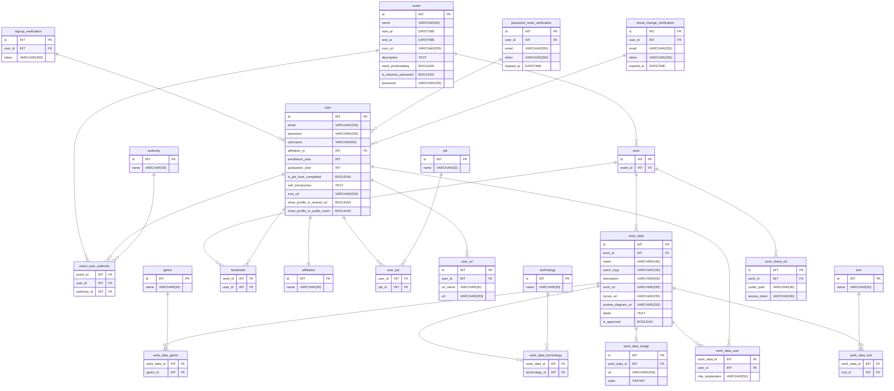

```mermaid
erDiagram

    event ||--o{ event_user_authority : ""
    event ||--o{ work : ""
    work ||--o{ work_data : ""
    work_data ||--o{ work_data_genre : ""
    work_data ||--o{ work_data_technology : ""
    work_data ||--|{ work_data_image : ""
    work_data ||--o{ work_data_user : ""
    work ||--o{ bookmark : ""
    user ||--o{ work_data_user : ""
    user ||--o{ bookmark : ""
    user ||--o{ event_user_authority : ""
    user ||--|| affiliation : ""
    user ||--o{ user_job : ""
    user ||--o{ user_url : ""
    job ||--o{ user_job : ""
    genre ||--o{ work_data_genre : ""
    technology ||--o{ work_data_technology : ""
    authority ||--o{ event_user_authority : ""
    tool ||--o{ work_data_tool : ""
    signup_verification ||--o{ user : ""
    password_reset_verification ||--o{ user : ""
    email_change_verification ||--o{ user : ""
    work_data ||--o{ work_data_tool : ""
    work ||--o{ work_share_url : ""

    bookmark {
        work_id INT FK
        user_id INT FK
    }

    affiliation {
        id INT PK
        name VARCHAR(30)
    }

    event {
        id INT PK
        name VARCHAR(50)
        start_at DATETIME
        end_at DATETIME
        icon_url VARCHAR(255)
        description TEXT
        need_proofreading BOOLEAN
        is_requires_password BOOLEAN
        password VARCHAR(255)
    }

    genre {
        id INT PK
        name VARCHAR(30)
    }

    job {
        id INT PK
        name VARCHAR(30)
    }

    authority {
        id INT PK
        name VARCHAR(30)
    }

    technology {
        id INT PK
        name VARCHAR(30)
    }

    user {
        id INT PK
        email VARCHAR(255)
        password VARCHAR(255)
        username VARCHAR(50)
        affiliation_id INT FK
        enrollment_year INT
        graduation_year INT
        is_job_hunt_completed BOOLEAN
        self_introduction TEXT
        icon_url VARCHAR(255)
        show_profile_in_shared_url BOOLEAN
        show_profile_in_public_event BOOLEAN
    }

    user_job {
        user_id INT FK
        job_id INT FK
    }

    user_url {
        id INT PK
        user_id INT FK
        url_name VARCHAR(30)
        url VARCHAR(255)
    }

    work {
        id INT PK
        event_id INT FK
    }

    work_data {
        id INT PK
        work_id INT FK
        name VARCHAR(100)
        catch_copy VARCHAR(100)
        description VARCHAR(500)
        work_url VARCHAR(255)
        movie_url VARCHAR(255)
        system_diagram_url VARCHAR(255)
        detail TEXT
        is_approved BOOLEAN
    }

    work_data_genre {
        work_data_id INT FK
        genre_id INT FK
    }

    work_data_technology {
        work_data_id INT FK
        technology_id INT FK
    }

    work_data_user {
        work_data_id INT FK
        user_id INT FK
        role_explanation VARCHAR(50)
    }

    tool {
        id INT PK
        name VARCHAR(30)
    }

    event_user_authority {
        event_id INT FK
        user_id INT FK
        authority_id INT FK
    }

    work_data_image {
        id INT PK
        work_data_id INT FK
        url VARCHAR(255)
        order TINYINT
    }

    work_data_tool {
        work_data_id INT FK
        tool_id INT FK
    }

    signup_verification {
        id INT PK
        user_id INT FK
        token VARCHAR(255)
    }

    password_reset_verification {
        id INT PK
        user_id INT FK
        email VARCHAR(255)
        token VARCHAR(255)
        expired_at DATETIME
    }

    email_change_verification {
        id INT PK
        user_id INT FK
        email VARCHAR(255)
        token VARCHAR(255)
        expired_at DATETIME
    }

    work_share_url {
        id INT PK
        work_id INT FK
        public_path VARCHAR(36)
        access_token VARCHAR(36)
    }

```
